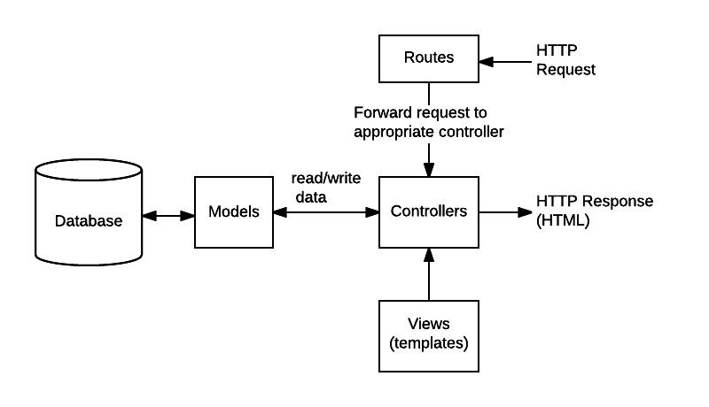

# CSCI3100Project
## !!!Anouncement for both frontend and backend!!!
To make the frontend, backend, and database more separated from each other and development of each part easier, I propose the following interface for interation between each part:
1. For the communication between frontend and backend, please send http request to specified url (maybe we can specify it in next meeting). For example, for Login, frontend might send http post request to url http://localhost:9000/Login and wait for response from backend. You can refer to current code in frontend Login as a naive example. The detail of request and response will be specified later.
2. For the arrangement of backend, there are some changes so that now it is a little different from the description I made on zoom. Besides routes, there is one more folder called controller. As shown in this diagram (omit the Views), routers under the routes folder do not process the request, but direct the request to appropriate controller. The controllers process the request and send response. A naive example is the testLogin.js under routes folder and testLoginCtrl.js under controllers folder.
3. For communication between backend and database, I create a dbControllers folder under controllers folder. In that folder, I will provide all required functions of database read/write for features like Login and Replay. You can refer to the interaction between testLogin.js,testLoginCtrl.js, and testLoginDbCtrl.js as an example. More detail will be specified in later meeting.

### Introduction
This is our CSCI3100 project Gobang. This project use React as frontend framework and Express as backend framework. Frontend and backend are seperated and placed in folder "client" and "api" respectively.

### Setup
Assume that you have installed node.js. Download and unzip the package into whatever path you like. Open cmd and type command (change [PATH] to your path):
```
cd [PATH]/CSCI3100Project/client
```
Install the dependencies with 
```
npm install
```
Start the server with
```
npm start
```
Open the url http://localhost:3000 in your browser and you will see a single head "This is login page", which means you setup the front end successfully. Next, open a new cmd and go to the folder of backend:
```
cd [PATH]/CSCI3100Project/api
npm install
npm start
```
After the backend server starts, refresh the http://localhost:3000 page. If you can find "API works properly" appear under the head, then you successfully setup backend server too. What's more, you can also open url http://localhost:9000, where the backend runs. If you can see some message about Express, then you successfully setup backed server.

### TO DO
Vox: Prepare all the required dbController.

### History
3/7: Vox: Initialize the backend and frontend.

3/7: Vox: Change every component to pure function.

3/8: Vox: Build basic four main pages and the way to switch from page to page. Build a simple chessboard adapted from the React tic-tac-toe tutorial.

3/20: Vox: Change the css layout from flex to grid so that the components will not move when the components change. Make the chessboard more appealing and natural.

3/21：Vox: Fix the length of grid column so that the window size will not affect chessboard. Make the history scrollable component to prevent the page become scrollable.

3/22: Add some comments to the frontend and backend codes I wrote. Change the backend to MVC structure (omit V since we have backend).

### Documents
All the documents such as high-level design, data flow diagram of this project is placed in folder "Documents"


